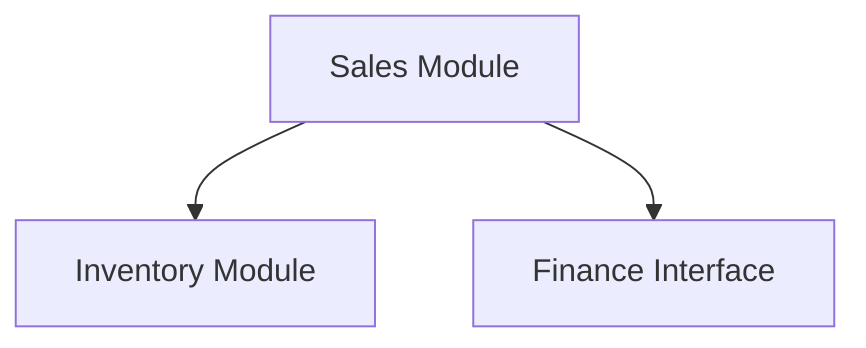
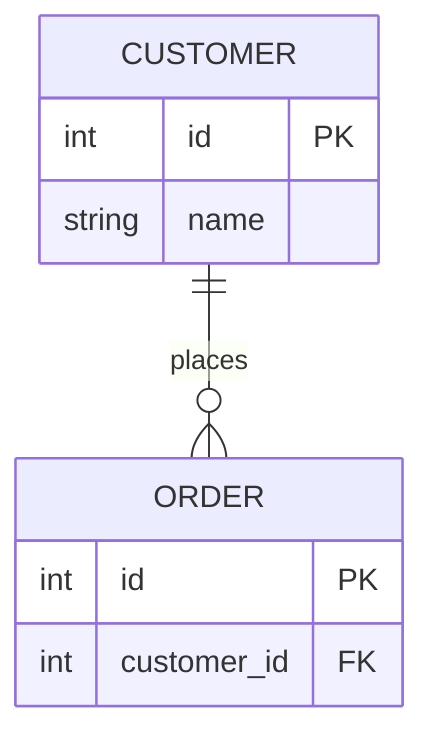
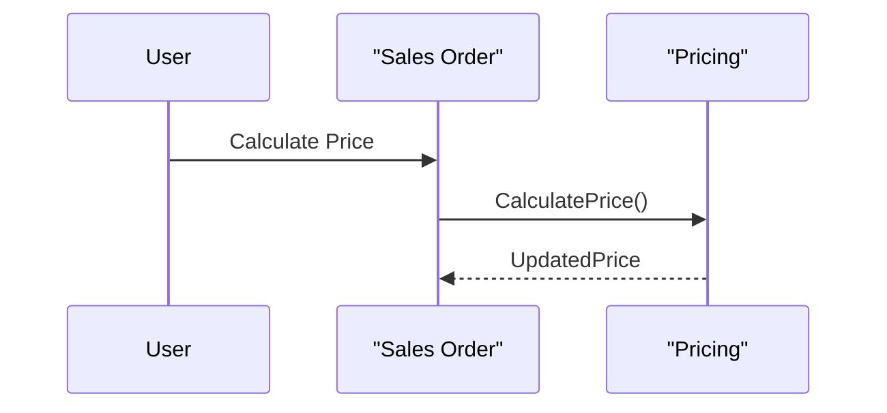

## AL Project Analysis Prompt (Business Central)

**Objective:** Perform comprehensive analysis of the AL codebase to generate detailed Markdown documentation in `.aidocs` folder. Create a complete onboarding guide covering architecture, components, data structures, functionalities, best practices, and improvement areas.

**Core Instructions:** Research the codebase by tracing logic, identifying patterns, and inferring relationships. Evaluate against AL development best practices (Microsoft, alguidelines.dev).

**I. Project Overview (`.aidocs/01_project_overview.md`):**

1. **Project Identification:** Extract from `app.json`: `id`, `name`, `publisher`, `version`, `description`, `dependencies`, `platform`, `application`, `idRanges`. Infer business domain and purpose. Identify BC version compatibility.

2. **Development Environment:** Check `.vscode/settings.json` for AL settings (`al.ruleSetPath`, `al.codeAnalyzers`, `al.enableCodeAnalysis`). Check for custom ruleset files and third-party analyzers (LinterCop). Document implications.

**II. Codebase Structure (`.aidocs/02_codebase_structure.md`):**

1. **Folder/File Structure:** Describe `src` directory organization and functional groupings. Analyze file naming conventions (`<ObjectName>.<FullTypeName>.al`) and Microsoft abbreviations adherence.

2. **Naming Conventions:** Document object naming patterns (prefix/suffix), PascalCase usage. Analyze variable naming (`Temp` prefix, descriptive record names) and method naming.

3. **Code Formatting:** Assess AL formatting practices (lowercase keywords, indentation, brackets). Comment on readability and commenting quality.

4. **Internal Structure:** Check standard object structure adherence: Properties → Object constructs → Global Variables → Methods.

**III. Architecture (`.aidocs/03_architecture.md`):**

1. **High-Level Architecture:** Describe architectural style (monolithic vs modular). Identify main modules/components with their purpose and key AL objects (top 5-10 per module).

2. **Component Interactions:** Describe module interactions (direct calls, events, interfaces). Generate **Mermaid Component Diagram**:


3. **Design Patterns:** Identify patterns (Facade, Singleton, Observer/Events, Strategy, DTOs). Provide specific examples with object names.

4. **Architectural Concerns:** Identify anti-patterns (God Objects, tight coupling, lack of cohesion, circular dependencies). Provide examples and impact assessment.

**IV. Data Model (`.aidocs/04_data_model.md`):**

1. **Core Entities:** List all tables with primary keys and 5-10 significant fields. Describe relationships between tables.

2. **ERD:** Generate **Mermaid ER Diagram** for core tables:

Include separate ERD for table extensions if applicable.

3. **Enums/Options:** List custom Enums and Option fields with values and meanings.

4. **Data Validation:** Describe validation patterns (table triggers, page triggers, codeunits). Provide examples.

**V. Key Flows (`.aidocs/05_key_flows.md`):**

1. **Core Processes:** Identify all critical business processes/workflows implemented by the extension.

2. **Flow Analysis:** For each process, document:
   - Entry points (page actions, job queue, event subscribers)
   - Sequence of operations (AL objects and procedures)
   - Data transformations (CRUD operations)
   - Decision points and user interactions

3. **Flow Diagrams:** Generate **Mermaid Sequence or Activity Diagrams** for all critical flows:


**VI. Eventing & Extensibility (`.aidocs/06_eventing_extensibility.md`):**

1. **Published Events:** List custom business/integration events with procedure signatures, purpose, and trigger conditions.

2. **Event Subscribers:** List all subscribers with `ObjectType`, `ObjectNumber/Name`, `EventName`, `EventPublisherElement`, procedure signatures, and purposes.

3. **Interfaces:** List defined/implemented interfaces with methods and purposes. List implementing objects.

4. **API Pages/Queries:** List APIs with `APIPublisher`, `APIGroup`, `APIVersion`, `EntityName`, `EntitySetName` properties and purposes.

5. **Extension Points:** Identify other extensibility mechanisms (setup tables, facade codeunits, abstract patterns).

**VII. Integrations (`.aidocs/07_integrations.md`):**

1. **External Systems:** Identify integrations using `HttpClient`, `WebService`, `DotNet`, file import/export. For each: describe purpose, external system, communication method, authentication, and key AL objects.

2. **Internal Integrations:** Describe integrations with other BC apps/modules beyond simple lookups (event subscriptions, API calls, complex extensions).

**VIII. Code Quality (`.aidocs/08_code_quality.md`):**

1. **CodeCop/AppSourceCop Adherence:** Assess adherence to common rules (`TextConst` usage, `Commit` usage, variable scope, avoiding `WITH`, `SetAutoCalcFields`). Highlight common deviations.

2. **Error Handling:** Describe strategies (`Error()`, `TryFunction`, `Confirm`/`StrMenu`). Assess message quality.

3. **Performance:** Identify potential issues (inefficient SIFT/CALCFIELDS, poor record iteration, excessive DB calls in loops, locking issues). Provide examples.

4. **Security:** Identify concerns (missing permission checks, hardcoded secrets, SQL injection risks, insecure API usage).

5. **Testability:** Comment on testability (test libraries, logic separation for unit testing).

**IX. Suggested Diagrams (`.aidocs/09_suggested_diagrams.md`):**

1. Suggest 3-5 additional diagram types beneficial for this specific codebase. For each:
   - **Diagram Type:** (State, Deployment, Data Flow, etc.)
   - **Rationale:** Why valuable for this project and which system part to focus on
   - **Mermaid Example:** Basic syntax example if feasible

**X. Onboarding Summary (`.aidocs/10_onboarding_summary.md`):**

1. **Key Strengths:** List 2-3 notable strengths (well-structured, good events usage, clear naming).
2. **Areas for Improvement:** List 2-3 areas for attention or future refactoring.
3. **First Steps:** Suggest 2-3 specific areas/modules for new developers to focus on first.

**XI. Documentation Index (`.aidocs/index.md`):**

1. **Main Entry Point:** Create index.md as main documentation entry point.
2. **Content Requirements:**
   - **Title/Introduction:** Extension purpose, target audience, business value
   - **Table of Contents:** Links to all 10 files (01_project_overview.md through 10_onboarding_summary.md)
   - **Document Descriptions:** 1-2 sentence description for each document
   - **Usage Guidance:** How different roles use documentation (New Developers, Experienced Developers, Architects, Project Managers)

**Output Format:**

- **Markdown format** in `.aidocs` folder
- Create files: `01_project_overview.md` through `10_onboarding_summary.md` and `index.md`
- Use professional prose and Markdown tables for structured data
- Enclose Mermaid diagrams in ` ```mermaid ... ``` ` blocks
- Ensure accurate file paths and object names
- Add navigation links at bottom of each file:
  - First: "Next" and "Back to Index"
  - Middle: "Previous", "Next", and "Back to Index"
  - Last: "Previous" and "Back to Index"

**Final Instruction:** Review all documentation for accuracy, completeness, and clarity. Produce high-quality, insightful onboarding package.
